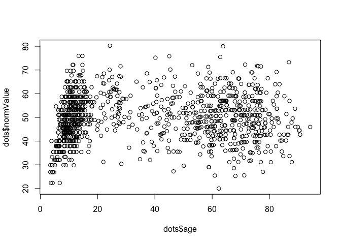

<!-- README.md is generated from README.Rmd. Please edit that file -->

# bwu: BrainWorkUp neuropsychological package

# Neuropsychological Testing Data Package

<!-- badges: start -->

[](https://github.com/brainworkup/bwu/actions/workflows/R-CMD-check.yaml)
<!-- badges: end -->

The goal of bwu is to …

## Installation

You can install the developmental version of bwu from
[GitHub](https://github.com) with:

``` r
devtools::install_github("brainworkup/bwu")
```

## Example

This is a basic example which shows you how to solve a common problem:

```r
library(bwu)
```

What is special about using `README.Rmd` instead of just `README.md`? You can
include R chunks like so:

```r
summary(dots)
#>       raw             age          percentile             n        
#>  Min.   : 1.00   Min.   : 3.50   Min.   :0.001355   Min.   :152.0  
#>  1st Qu.:10.00   1st Qu.:11.30   1st Qu.:0.256329   1st Qu.:305.0  
#>  Median :14.00   Median :29.00   Median :0.472222   Median :373.0  
#>  Mean   :14.08   Mean   :37.59   Mean   :0.491065   Mean   :402.1  
#>  3rd Qu.:18.00   3rd Qu.:63.80   3rd Qu.:0.740458   3rd Qu.:524.0  
#>  Max.   :27.00   Max.   :94.20   Max.   :0.998750   Max.   :524.0  
#>        m               md              sd          normValue    
#>  Min.   :13.40   Min.   :13.00   Min.   :4.271   Min.   :20.01  
#>  1st Qu.:13.40   1st Qu.:13.00   1st Qu.:4.806   1st Qu.:43.45  
#>  Median :14.25   Median :14.00   Median :5.062   Median :49.30  
#>  Mean   :14.25   Mean   :14.12   Mean   :4.920   Mean   :49.71  
#>  3rd Qu.:14.73   3rd Qu.:15.00   3rd Qu.:5.062   3rd Qu.:56.45  
#>  Max.   :17.16   Max.   :17.00   Max.   :5.124   Max.   :80.23
```

You’ll still need to render `README.Rmd` regularly, to keep `README.md`
up-to-date. `devtools::build_readme()` is handy for this. You could also use
GitHub Actions to re-render `README.Rmd` every time you push. An example
workflow can be found here:
<https://github.com/r-lib/actions/tree/master/examples>.

You can also embed plots, for example:



In that case, don’t forget to commit and push the resulting figure files, so
they display on GitHub and CRAN.
