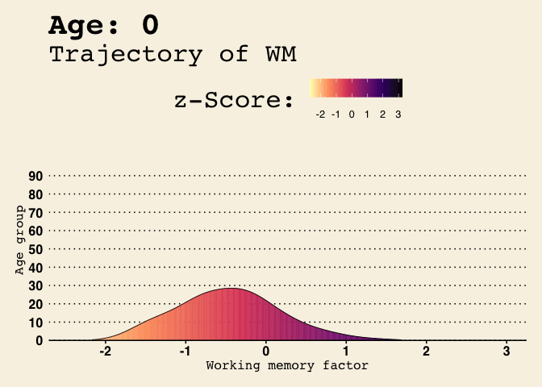

<!-- README.md is generated from README.Rmd. Please edit that file -->


# bwu (BrainWorkUp) R Package

<!-- badges: start -->

[](https://github.com/brainworkup/bwu/actions/workflows/check-release.yaml)

<!-- badges: end -->

The goal of `bwu` is to facilitate neuropsychological evaluation data
processing, report writing, and presentation of results.

## Installation

You can install the development version of `bwu` like so:

    #> ℹ Loading metadata database
    #> ✔ Loading metadata database ... done
    #> 
    #> 
    #> → Will install 112 packages.
    #> → Will update 1 package.
    #> → Will download 99 CRAN packages (108.92 MB), cached: 14 (32.10 MB).
    #> + assertthat                0.2.1        ⬇ (53.75 kB)
    #> + backports                 1.4.1        ⬇ (104.25 kB)
    #> + base64enc                 0.1-3        ⬇ (34.91 kB)
    #> + bigD                      0.2.0        ⬇ (1.16 MB)
    #> + bit                       4.0.5        ⬇ (1.29 MB)
    #> + bit64                     4.0.5        ⬇ (608.98 kB)
    #> + bitops                    1.0-7        ⬇ (32.77 kB)
    #> + bookdown                  0.39        
    #> + broom                     1.0.5       
    #> + bslib                     0.7.0        ⬇ (5.33 MB)
    #> + bwu          0.0.1.9006 → 0.0.1.9006  👷🏼‍♂️🔧 (GitHub: a7f1f7e)
    #> + cachem                    1.0.8        ⬇ (69.61 kB)
    #> + cellranger                1.1.0        ⬇ (103.58 kB)
    #> + cli                       3.6.2        ⬇ (1.40 MB)
    #> + clipr                     0.8.0        ⬇ (51.67 kB)
    #> + colorspace                2.1-0        ⬇ (2.65 MB)
    #> + commonmark                1.9.1        ⬇ (357.98 kB)
    #> + crayon                    1.5.2        ⬇ (163.57 kB)
    #> + curl                      5.2.1        ⬇ (815.44 kB)
    #> + data.table                1.15.4       ⬇ (2.63 MB)
    #> + digest                    0.6.35       ⬇ (363.39 kB)
    #> + dplyr                     1.1.4        ⬇ (1.61 MB)
    #> + ellipsis                  0.3.2        ⬇ (39.35 kB)
    #> + evaluate                  0.23         ⬇ (83.61 kB)
    #> + fansi                     1.0.6        ⬇ (389.81 kB)
    #> + farver                    2.1.1        ⬇ (1.99 MB)
    #> + fastmap                   1.1.1        ⬇ (201.27 kB)
    #> + fontawesome               0.5.2        ⬇ (1.36 MB)
    #> + forcats                   1.0.0        ⬇ (424.77 kB)
    #> + fs                        1.6.4       
    #> + generics                  0.1.3        ⬇ (81.24 kB)
    #> + ggplot2                   3.5.1       
    #> + ggtext                    0.1.2        ⬇ (1.26 MB)
    #> + ggthemes                  5.1.0        ⬇ (444.08 kB)
    #> + glue                      1.7.0        ⬇ (160.13 kB)
    #> + gridtext                  0.1.5        ⬇ (956.23 kB)
    #> + gt                        0.10.1       ⬇ (4.70 MB)
    #> + gtable                    0.3.5       
    #> + gtExtras                  0.5.0       
    #> + here                      1.0.1        ⬇ (51.21 kB)
    #> + highcharter               0.9.4       
    #> + highr                     0.10         ⬇ (39.16 kB)
    #> + hms                       1.1.3        ⬇ (100.24 kB)
    #> + htmltools                 0.5.8.1     
    #> + htmlwidgets               1.6.4        ⬇ (805.45 kB)
    #> + igraph                    2.0.3        ⬇ (10.36 MB)
    #> + isoband                   0.2.7        ⬇ (1.88 MB)
    #> + janitor                   2.2.0        ⬇ (286.79 kB)
    #> + jpeg                      0.1-10       ⬇ (455.67 kB)
    #> + jquerylib                 0.1.4        ⬇ (526.41 kB)
    #> + jsonlite                  1.8.8        ⬇ (1.14 MB)
    #> + juicyjuice                0.1.0        ⬇ (1.13 MB)
    #> + kableExtra                1.4.0        ⬇ (2.04 MB)
    #> + knitr                     1.46        
    #> + labeling                  0.4.3        ⬇ (61.59 kB)
    #> + lifecycle                 1.0.4        ⬇ (124.76 kB)
    #> + lubridate                 1.9.3        ⬇ (1.01 MB)
    #> + magrittr                  2.0.3        ⬇ (233.70 kB)
    #> + markdown                  1.12         ⬇ (207.07 kB)
    #> + memoise                   2.0.1        ⬇ (49.08 kB)
    #> + mime                      0.12         ⬇ (36.75 kB)
    #> + munsell                   0.5.1        ⬇ (244.73 kB)
    #> + paletteer                 1.6.0        ⬇ (447.11 kB)
    #> + pillar                    1.9.0        ⬇ (651.77 kB)
    #> + pkgconfig                 2.0.3        ⬇ (18.49 kB)
    #> + png                       0.1-8        ⬇ (404.58 kB)
    #> + prismatic                 1.1.2       
    #> + purrr                     1.0.2        ⬇ (527.83 kB)
    #> + quantmod                  0.4.26       ⬇ (1.06 MB)
    #> + R6                        2.5.1        ⬇ (83.25 kB)
    #> + rappdirs                  0.3.3        ⬇ (47.51 kB)
    #> + RColorBrewer              1.1-3        ⬇ (53.31 kB)
    #> + Rcpp                      1.0.12       ⬇ (3.31 MB)
    #> + reactable                 0.4.4        ⬇ (1.06 MB)
    #> + reactR                    0.5.0        ⬇ (619.71 kB)
    #> + readr                     2.1.5        ⬇ (1.97 MB)
    #> + readxl                    1.4.3        ⬇ (1.55 MB)
    #> + rematch                   2.0.0        ⬇ (16.62 kB)
    #> + rematch2                  2.1.2        ⬇ (45.73 kB)
    #> + rJava                     1.0-11       ⬇ (790.86 kB)
    #> + rjson                     0.2.21       ⬇ (214.77 kB)
    #> + rlang                     1.1.3        ⬇ (1.91 MB)
    #> + rlist                     0.4.6.2      ⬇ (251.30 kB)
    #> + rmarkdown                 2.26         ⬇ (2.63 MB)
    #> + rprojroot                 2.0.4        ⬇ (105.91 kB)
    #> + rstudioapi                0.16.0       ⬇ (314.99 kB)
    #> + sass                      0.4.9        ⬇ (2.41 MB)
    #> + scales                    1.3.0        ⬇ (708.87 kB)
    #> + snakecase                 0.11.1       ⬇ (160.61 kB)
    #> + stringi                   1.8.4       
    #> + stringr                   1.5.1        ⬇ (313.90 kB)
    #> + svglite                   2.1.3        ⬇ (926.89 kB)
    #> + systemfonts               1.0.6        ⬇ (7.10 MB)
    #> + tabulapdf                 1.0.5-2     👷🏿‍♀️🔧 (GitHub: 6bd4946)
    #> + tibble                    3.2.1        ⬇ (689.38 kB)
    #> + tidyr                     1.3.1        ⬇ (1.32 MB)
    #> + tidyselect                1.2.1        ⬇ (224.46 kB)
    #> + timechange                0.3.0        ⬇ (879.08 kB)
    #> + tinytex                   0.51        
    #> + TTR                       0.24.4       ⬇ (551.08 kB)
    #> + tzdb                      0.4.0        ⬇ (1.26 MB)
    #> + utf8                      1.2.4        ⬇ (210.11 kB)
    #> + V8                        4.4.2        ⬇ (10.62 MB)
    #> + vctrs                     0.6.5        ⬇ (1.98 MB)
    #> + viridisLite               0.4.2        ⬇ (1.30 MB)
    #> + vroom                     1.6.5        ⬇ (3.13 MB)
    #> + withr                     3.0.0        ⬇ (241.08 kB)
    #> + xfun                      0.43         ⬇ (491.18 kB)
    #> + XML                       3.99-0.16.1  ⬇ (1.96 MB)
    #> + xml2                      1.3.6        ⬇ (528.14 kB)
    #> + xts                       0.13.2       ⬇ (922.67 kB)
    #> + yaml                      2.3.8        ⬇ (231.23 kB)
    #> + zoo                       1.8-12       ⬇ (1.03 MB)
    #> ℹ Getting 99 pkgs (108.92 MB), 14 (32.10 MB) cached
    #> ✔ Cached copy of R6 2.5.1 (x86_64-apple-darwin20) is the latest build
    #> ✔ Cached copy of RColorBrewer 1.1-3 (x86_64-apple-darwin20) is the latest build
    #> ✔ Cached copy of Rcpp 1.0.12 (x86_64-apple-darwin20) is the latest build
    #> ✔ Cached copy of TTR 0.24.4 (x86_64-apple-darwin20) is the latest build
    #> ✔ Cached copy of V8 4.4.2 (x86_64-apple-darwin20) is the latest build
    #> ✔ Cached copy of XML 3.99-0.16.1 (x86_64-apple-darwin20) is the latest build
    #> ✔ Cached copy of assertthat 0.2.1 (x86_64-apple-darwin20) is the latest build
    #> ✔ Cached copy of backports 1.4.1 (x86_64-apple-darwin20) is the latest build
    #> ✔ Cached copy of base64enc 0.1-3 (x86_64-apple-darwin20) is the latest build
    #> ✔ Cached copy of bigD 0.2.0 (x86_64-apple-darwin20) is the latest build
    #> ✔ Cached copy of bit64 4.0.5 (x86_64-apple-darwin20) is the latest build
    #> ✔ Cached copy of bit 4.0.5 (x86_64-apple-darwin20) is the latest build
    #> ✔ Cached copy of bitops 1.0-7 (x86_64-apple-darwin20) is the latest build
    #> ✔ Cached copy of bslib 0.7.0 (x86_64-apple-darwin20) is the latest build
    #> ✔ Cached copy of cachem 1.0.8 (x86_64-apple-darwin20) is the latest build
    #> ✔ Cached copy of cellranger 1.1.0 (x86_64-apple-darwin20) is the latest build
    #> ✔ Cached copy of clipr 0.8.0 (x86_64-apple-darwin20) is the latest build
    #> ✔ Cached copy of colorspace 2.1-0 (x86_64-apple-darwin20) is the latest build
    #> ✔ Cached copy of crayon 1.5.2 (x86_64-apple-darwin20) is the latest build
    #> ✔ Cached copy of curl 5.2.1 (x86_64-apple-darwin20) is the latest build
    #> ✔ Cached copy of data.table 1.15.4 (x86_64-apple-darwin20) is the latest build
    #> ✔ Cached copy of dplyr 1.1.4 (x86_64-apple-darwin20) is the latest build
    #> ✔ Cached copy of evaluate 0.23 (x86_64-apple-darwin20) is the latest build
    #> ✔ Cached copy of fansi 1.0.6 (x86_64-apple-darwin20) is the latest build
    #> ✔ Cached copy of farver 2.1.1 (x86_64-apple-darwin20) is the latest build
    #> ✔ Cached copy of fastmap 1.1.1 (x86_64-apple-darwin20) is the latest build
    #> ✔ Cached copy of fontawesome 0.5.2 (x86_64-apple-darwin20) is the latest build
    #> ✔ Cached copy of forcats 1.0.0 (x86_64-apple-darwin20) is the latest build
    #> ✔ Cached copy of generics 0.1.3 (x86_64-apple-darwin20) is the latest build
    #> ✔ Cached copy of ggtext 0.1.2 (x86_64-apple-darwin20) is the latest build
    #> ✔ Cached copy of glue 1.7.0 (x86_64-apple-darwin20) is the latest build
    #> ✔ Cached copy of gridtext 0.1.5 (x86_64-apple-darwin20) is the latest build
    #> ✔ Cached copy of gt 0.10.1 (x86_64-apple-darwin20) is the latest build
    #> ✔ Cached copy of here 1.0.1 (x86_64-apple-darwin20) is the latest build
    #> ✔ Cached copy of hms 1.1.3 (x86_64-apple-darwin20) is the latest build
    #> ✔ Cached copy of htmlwidgets 1.6.4 (x86_64-apple-darwin20) is the latest build
    #> ✔ Cached copy of igraph 2.0.3 (x86_64-apple-darwin20) is the latest build
    #> ✔ Cached copy of jpeg 0.1-10 (x86_64-apple-darwin20) is the latest build
    #> ✔ Cached copy of juicyjuice 0.1.0 (x86_64-apple-darwin20) is the latest build
    #> ✔ Cached copy of kableExtra 1.4.0 (x86_64-apple-darwin20) is the latest build
    #> ✔ Cached copy of labeling 0.4.3 (x86_64-apple-darwin20) is the latest build
    #> ✔ Cached copy of lifecycle 1.0.4 (x86_64-apple-darwin20) is the latest build
    #> ✔ Cached copy of lubridate 1.9.3 (x86_64-apple-darwin20) is the latest build
    #> ✔ Cached copy of magrittr 2.0.3 (x86_64-apple-darwin20) is the latest build
    #> ✔ Cached copy of markdown 1.12 (x86_64-apple-darwin20) is the latest build
    #> ✔ Cached copy of memoise 2.0.1 (x86_64-apple-darwin20) is the latest build
    #> ✔ Cached copy of munsell 0.5.1 (x86_64-apple-darwin20) is the latest build
    #> ✔ Cached copy of pillar 1.9.0 (x86_64-apple-darwin20) is the latest build
    #> ✔ Cached copy of pkgconfig 2.0.3 (x86_64-apple-darwin20) is the latest build
    #> ✔ Cached copy of purrr 1.0.2 (x86_64-apple-darwin20) is the latest build
    #> ✔ Cached copy of quantmod 0.4.26 (x86_64-apple-darwin20) is the latest build
    #> ✔ Cached copy of reactR 0.5.0 (x86_64-apple-darwin20) is the latest build
    #> ✔ Cached copy of reactable 0.4.4 (x86_64-apple-darwin20) is the latest build
    #> ✔ Cached copy of readr 2.1.5 (x86_64-apple-darwin20) is the latest build
    #> ✔ Cached copy of readxl 1.4.3 (x86_64-apple-darwin20) is the latest build
    #> ✔ Cached copy of rematch2 2.1.2 (x86_64-apple-darwin20) is the latest build
    #> ✔ Cached copy of rematch 2.0.0 (x86_64-apple-darwin20) is the latest build
    #> ✔ Cached copy of rjson 0.2.21 (x86_64-apple-darwin20) is the latest build
    #> ✔ Cached copy of rlist 0.4.6.2 (x86_64-apple-darwin20) is the latest build
    #> ✔ Cached copy of rmarkdown 2.26 (x86_64-apple-darwin20) is the latest build
    #> ✔ Cached copy of rprojroot 2.0.4 (x86_64-apple-darwin20) is the latest build
    #> ✔ Cached copy of rstudioapi 0.16.0 (x86_64-apple-darwin20) is the latest build
    #> ✔ Cached copy of snakecase 0.11.1 (x86_64-apple-darwin20) is the latest build
    #> ✔ Cached copy of svglite 2.1.3 (x86_64-apple-darwin20) is the latest build
    #> ✔ Cached copy of systemfonts 1.0.6 (x86_64-apple-darwin20) is the latest build
    #> ✔ Cached copy of tibble 3.2.1 (x86_64-apple-darwin20) is the latest build
    #> ✔ Cached copy of tidyr 1.3.1 (x86_64-apple-darwin20) is the latest build
    #> ✔ Cached copy of tidyselect 1.2.1 (x86_64-apple-darwin20) is the latest build
    #> ✔ Cached copy of timechange 0.3.0 (x86_64-apple-darwin20) is the latest build
    #> ✔ Cached copy of tzdb 0.4.0 (x86_64-apple-darwin20) is the latest build
    #> ✔ Cached copy of utf8 1.2.4 (x86_64-apple-darwin20) is the latest build
    #> ✔ Cached copy of vroom 1.6.5 (x86_64-apple-darwin20) is the latest build
    #> ✔ Cached copy of xml2 1.3.6 (x86_64-apple-darwin20) is the latest build
    #> ✔ Cached copy of xts 0.13.2 (x86_64-apple-darwin20) is the latest build
    #> ✔ Cached copy of yaml 2.3.8 (x86_64-apple-darwin20) is the latest build
    #> ✔ Got commonmark 1.9.1 (x86_64-apple-darwin20) (358.00 kB)
    #> ✔ Got ellipsis 0.3.2 (x86_64-apple-darwin20) (39.40 kB)
    #> ✔ Got digest 0.6.35 (x86_64-apple-darwin20) (363.45 kB)
    #> ✔ Got stringr 1.5.1 (x86_64-apple-darwin20) (314.03 kB)
    #> ✔ Got png 0.1-8 (x86_64-apple-darwin20) (404.57 kB)
    #> ✔ Got cli 3.6.2 (x86_64-apple-darwin20) (1.40 MB)
    #> ✔ Got janitor 2.2.0 (x86_64-apple-darwin20) (286.84 kB)
    #> ✔ Got jquerylib 0.1.4 (x86_64-apple-darwin20) (526.39 kB)
    #> ✔ Got paletteer 1.6.0 (x86_64-apple-darwin20) (447.50 kB)
    #> ✔ Got highr 0.10 (x86_64-apple-darwin20) (39.16 kB)
    #> ✔ Got mime 0.12 (x86_64-apple-darwin20) (36.77 kB)
    #> ✔ Got rappdirs 0.3.3 (x86_64-apple-darwin20) (47.62 kB)
    #> ✔ Got withr 3.0.0 (x86_64-apple-darwin20) (242.22 kB)
    #> ✔ Got isoband 0.2.7 (x86_64-apple-darwin20) (1.88 MB)
    #> ✔ Got tinytex 0.51 (x86_64-apple-darwin20) (140.79 kB)
    #> ✔ Got ggthemes 5.1.0 (x86_64-apple-darwin20) (449.75 kB)
    #> ✔ Got rJava 1.0-11 (x86_64-apple-darwin20) (791.57 kB)
    #> ✔ Got bwu 0.0.1.9006 (source) (4.84 MB)
    #> ✔ Got scales 1.3.0 (x86_64-apple-darwin20) (709.68 kB)
    #> ✔ Got xfun 0.43 (x86_64-apple-darwin20) (489.62 kB)
    #> ✔ Got zoo 1.8-12 (x86_64-apple-darwin20) (1.03 MB)
    #> ✔ Got knitr 1.46 (x86_64-apple-darwin20) (1.05 MB)
    #> ✔ Got jsonlite 1.8.8 (x86_64-apple-darwin20) (1.14 MB)
    #> ✔ Got rlang 1.1.3 (x86_64-apple-darwin20) (1.91 MB)
    #> ✔ Got sass 0.4.9 (x86_64-apple-darwin20) (2.41 MB)
    #> ✔ Got vctrs 0.6.5 (x86_64-apple-darwin20) (1.98 MB)
    #> ✔ Got viridisLite 0.4.2 (x86_64-apple-darwin20) (1.30 MB)
    #> ✔ Got ggplot2 3.5.1 (x86_64-apple-darwin20) (4.98 MB)
    #> ✔ Installed R6 2.5.1  (625ms)
    #> ✔ Installed RColorBrewer 1.1-3  (666ms)
    #> ✔ Installed Rcpp 1.0.12  (667ms)
    #> ✔ Installed TTR 0.24.4  (657ms)
    #> ✔ Installed V8 4.4.2  (647ms)
    #> ✔ Installed XML 3.99-0.16.1  (638ms)
    #> ✔ Installed assertthat 0.2.1  (628ms)
    #> ✔ Installed backports 1.4.1  (619ms)
    #> ✔ Installed base64enc 0.1-3  (610ms)
    #> ✔ Installed bigD 0.2.0  (601ms)
    #> ✔ Installed bit64 4.0.5  (616ms)
    #> ✔ Installed bit 4.0.5  (606ms)
    #> ✔ Installed bitops 1.0-7  (593ms)
    #> ✔ Installed bookdown 0.39  (590ms)
    #> ✔ Installed broom 1.0.5  (630ms)
    #> ✔ Installed bslib 0.7.0  (666ms)
    #> ✔ Installed cachem 1.0.8  (106ms)
    #> ✔ Installed cellranger 1.1.0  (102ms)
    #> ✔ Installed cli 3.6.2  (104ms)
    #> ✔ Installed clipr 0.8.0  (159ms)
    #> ✔ Installed colorspace 2.1-0  (115ms)
    #> ✔ Installed commonmark 1.9.1  (107ms)
    #> ✔ Installed crayon 1.5.2  (104ms)
    #> ✔ Installed curl 5.2.1  (106ms)
    #> ✔ Installed data.table 1.15.4  (105ms)
    #> ✔ Installed digest 0.6.35  (105ms)
    #> ✔ Installed dplyr 1.1.4  (107ms)
    #> ✔ Installed ellipsis 0.3.2  (107ms)
    #> ✔ Installed evaluate 0.23  (392ms)
    #> ✔ Installed fansi 1.0.6  (109ms)
    #> ✔ Installed farver 2.1.1  (104ms)
    #> ✔ Installed fastmap 1.1.1  (171ms)
    #> ✔ Installed fontawesome 0.5.2  (153ms)
    #> ✔ Installed forcats 1.0.0  (106ms)
    #> ✔ Installed fs 1.6.4  (109ms)
    #> ✔ Installed generics 0.1.3  (107ms)
    #> ✔ Installed ggplot2 3.5.1  (116ms)
    #> ✔ Installed ggtext 0.1.2  (159ms)
    #> ✔ Installed ggthemes 5.1.0  (111ms)
    #> ✔ Installed glue 1.7.0  (101ms)
    #> ✔ Installed gridtext 0.1.5  (104ms)
    #> ✔ Installed gtExtras 0.5.0  (110ms)
    #> ✔ Installed gt 0.10.1  (125ms)
    #> ✔ Installed gtable 0.3.5  (115ms)
    #> ✔ Installed here 1.0.1  (101ms)
    #> ✔ Installed highcharter 0.9.4  (108ms)
    #> ✔ Installed highr 0.10  (146ms)
    #> ✔ Installed hms 1.1.3  (114ms)
    #> ✔ Installed htmltools 0.5.8.1  (114ms)
    #> ✔ Installed htmlwidgets 1.6.4  (115ms)
    #> ✔ Installed igraph 2.0.3  (141ms)
    #> ✔ Installed isoband 0.2.7  (145ms)
    #> ✔ Installed janitor 2.2.0  (121ms)
    #> ✔ Installed jpeg 0.1-10  (121ms)
    #> ✔ Installed jquerylib 0.1.4  (110ms)
    #> ✔ Installed jsonlite 1.8.8  (148ms)
    #> ✔ Installed juicyjuice 0.1.0  (103ms)
    #> ✔ Installed kableExtra 1.4.0  (106ms)
    #> ✔ Installed knitr 1.46  (106ms)
    #> ✔ Installed labeling 0.4.3  (94ms)
    #> ✔ Installed lifecycle 1.0.4  (89ms)
    #> ✔ Installed lubridate 1.9.3  (102ms)
    #> ✔ Installed magrittr 2.0.3  (111ms)
    #> ✔ Installed markdown 1.12  (121ms)
    #> ✔ Installed memoise 2.0.1  (144ms)
    #> ✔ Installed mime 0.12  (115ms)
    #> ✔ Installed munsell 0.5.1  (112ms)
    #> ✔ Installed paletteer 1.6.0  (110ms)
    #> ✔ Installed pillar 1.9.0  (107ms)
    #> ✔ Installed pkgconfig 2.0.3  (102ms)
    #> ✔ Installed png 0.1-8  (103ms)
    #> ✔ Installed prismatic 1.1.2  (93ms)
    #> ✔ Installed purrr 1.0.2  (88ms)
    #> ✔ Installed quantmod 0.4.26  (121ms)
    #> ✔ Installed rappdirs 0.3.3  (90ms)
    #> ✔ Installed reactR 0.5.0  (96ms)
    #> ✔ Installed reactable 0.4.4  (99ms)
    #> ✔ Installed readr 2.1.5  (94ms)
    #> ✔ Installed readxl 1.4.3  (92ms)
    #> ✔ Installed rematch2 2.1.2  (86ms)
    #> ✔ Installed rematch 2.0.0  (83ms)
    #> ✔ Installed rjson 0.2.21  (83ms)
    #> ✔ Installed rlang 1.1.3  (137ms)
    #> ✔ Installed rlist 0.4.6.2  (92ms)
    #> ✔ Installed rprojroot 2.0.4  (34ms)
    #> ✔ Installed rmarkdown 2.26  (188ms)
    #> ✔ Installed rstudioapi 0.16.0  (99ms)
    #> ✔ Installed sass 0.4.9  (97ms)
    #> ✔ Installed scales 1.3.0  (97ms)
    #> ✔ Installed snakecase 0.11.1  (90ms)
    #> ✔ Installed stringr 1.5.1  (38ms)
    #> ✔ Installed stringi 1.8.4  (215ms)
    #> ✔ Installed svglite 2.1.3  (100ms)
    #> ✔ Installed systemfonts 1.0.6  (104ms)
    #> ✔ Installed tibble 3.2.1  (109ms)
    #> ✔ Installed tidyr 1.3.1  (102ms)
    #> ✔ Installed tidyselect 1.2.1  (94ms)
    #> ✔ Installed timechange 0.3.0  (91ms)
    #> ✔ Installed tinytex 0.51  (98ms)
    #> ✔ Installed tzdb 0.4.0  (102ms)
    #> ✔ Installed utf8 1.2.4  (124ms)
    #> ✔ Installed vctrs 0.6.5  (104ms)
    #> ✔ Installed viridisLite 0.4.2  (92ms)
    #> ✔ Installed vroom 1.6.5  (95ms)
    #> ✔ Installed withr 3.0.0  (95ms)
    #> ✔ Installed xfun 0.43  (101ms)
    #> ✔ Installed xml2 1.3.6  (155ms)
    #> ✔ Installed xts 0.13.2  (106ms)
    #> ✔ Installed yaml 2.3.8  (93ms)
    #> ✔ Installed zoo 1.8-12  (146ms)
    #> ✔ Installed tabulapdf 1.0.5-2 (github::ropensci/tabulapdf@6bd4946) (120ms)
    #> ✔ Installed rJava 1.0-11  (57ms)
    #> ℹ Packaging bwu 0.0.1.9006
    #> ✔ Packaged bwu 0.0.1.9006 (2.3s)
    #> ℹ Building bwu 0.0.1.9006
    #> ✔ Built bwu 0.0.1.9006 (8.1s)
    #> ✔ Installed bwu 0.0.1.9006 (github::brainworkup/bwu@a7f1f7e) (147ms)
    #> ✔ 1 pkg + 117 deps: kept 5, upd 1, added 112, dld 28 (NA B) [33.9s]

## Example

This is a basic example which shows you how to solve a common problem:

    #> Registered S3 method overwritten by 'quantmod':
    #>   method            from
    #>   as.zoo.data.frame zoo

What is special about using `README.Rmd` instead of just `README.md`?
You can include R chunks like so:

``` r
summary(dots)
#>       raw             age          percentile             n        
#>  Min.   : 1.00   Min.   : 3.50   Min.   :0.001355   Min.   :152.0  
#>  1st Qu.:10.00   1st Qu.:11.30   1st Qu.:0.256329   1st Qu.:305.0  
#>  Median :14.00   Median :29.00   Median :0.472222   Median :373.0  
#>  Mean   :14.08   Mean   :37.59   Mean   :0.491065   Mean   :402.1  
#>  3rd Qu.:18.00   3rd Qu.:63.80   3rd Qu.:0.740458   3rd Qu.:524.0  
#>  Max.   :27.00   Max.   :94.20   Max.   :0.998750   Max.   :524.0  
#>        m               md              sd          normValue    
#>  Min.   :13.40   Min.   :13.00   Min.   :4.271   Min.   :20.01  
#>  1st Qu.:13.40   1st Qu.:13.00   1st Qu.:4.806   1st Qu.:43.45  
#>  Median :14.25   Median :14.00   Median :5.062   Median :49.30  
#>  Mean   :14.25   Mean   :14.12   Mean   :4.920   Mean   :49.71  
#>  3rd Qu.:14.73   3rd Qu.:15.00   3rd Qu.:5.062   3rd Qu.:56.45  
#>  Max.   :17.16   Max.   :17.00   Max.   :5.124   Max.   :80.23
```

# `bwu` Analysis, Plotting, and Reporting

## Developmental Changes in Working Memory

### Figure 1


### Figure 2



------------------------------------------------------------------------

<!-- README.md is generated from README.Rmd. Please edit that file -->
